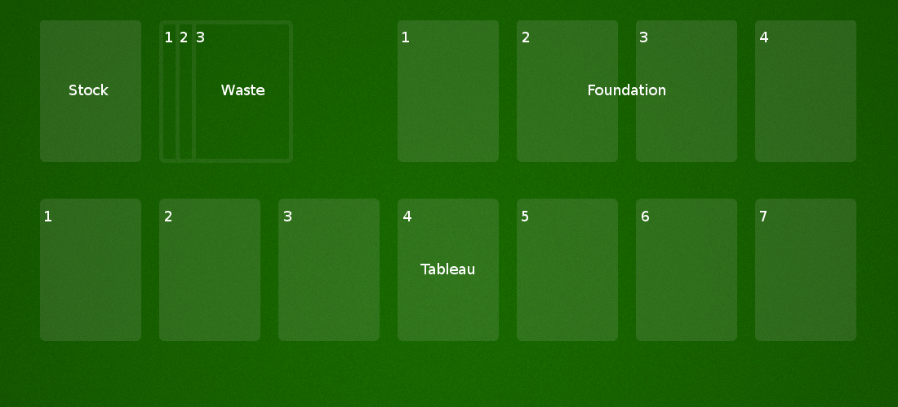

# SOLITAIRE in javascript

*Using CSS transitions and HTML drag-and-drop*

## Overview

This is a simple implementation of Patience, the popular solitaire card game.  It's written to 
run in the web browser, mostly in javascript.  The animations are all done using CSS 
transitions, and the mouse controls are all HTML drag-and-drop functions.  That's pretty much 
it.  There are no other 3rd-party libraries.  No, not even JQuery.

This code was written primarily as an exercise in the basic use of CSS transitions and HTML 
drag-and-drop.  I'm pretty happy with it.

The card images were generously donated to the public, and were downloaded from Wikimedia Commons
at

`https://commons.wikimedia.org/wiki/File:Atlasnye_playing_cards_deck.svg`

### Things Left As An Exercise For The Reader
*Or, yeah, I'll get to it tomorrow.*

This game is entirely playable as it, but it's missing a few pretty standard features:

* The game is not limited to three turns of the stock
* There's no "undo" feature.
* There's no "Hint" button.
* Double-clicking does absolutely nothing; you actually have to drag a card to play it.
* There's no auto-play feature;  this really gets annoying towards the end of a game.
* There's no **YOU WIN** animation when the player, you know, wins.
* No memory; you can't come back later and resume a game.

Implementing *undo* is not trivial, but is a well-understood problem.  You can find any number 
of explanations on the Internet.

The "Hint" button requires logic for finding valid moves.  It should be straightforward to 
adapt the existing logic for determining whether a player's move is valid.  After that, it's 
implementing just an exhaustive search.

The other features should be straightforward to implement.

Also, this is really not very pretty or exciting to look at.  There's lots of room for 
improvement here for anyone who has talent in that arena.

## Implementation Notes

### Some terminology

Since terminology can differ from player to player, here's a guide to the terminology used in 
this project.

There are four general areas on the card table where cards are stacked:

* When the game begins, the deck of cards are shuffled, and placed face down on the **stock**.  In this game, the stock is located in the upper left corner of the table.

* Cards are dealt from the stock onto the **tableau**, which consists of seven columns of cards.  The tableau is located at the bottom of the table.

* The player turns cards three at a time from the stock into the **waste**, which is located to the right of the stock.

* The goal is to move all the cards into the **foundation**, which consists of four stacks, one per suit.  The foundation is in the upper right of the table.



Columns in the tableau are numbered 1 through 7, from left to right.  Stacks in the foundation 
are similarly number 1 through 4, from left to right.

The three cards turned over from the stock onto the waste are spread slightly so that all 
three are visible.  The bottom card on the left is considered column 1, the middle card is 
column 2, and the top card on the right is column 3.

### Internal data structures

This code maintains several lists of cards:  one list of all the cards in the stock; another 
list of all the cards in the waste; an array of four lists, one for each stack in the 
foundation; and another array of seven lists, one for each column in the tableau:

```javascript
var solitaire = {
    stock: [],
    waste: [],
    foundation: [ [], [], [], [] ],
    tableau: [ [], [], [], [], [], [], [] ],
};
```

This duplicates information recorded in the DOM elements' class names and HTML attributes, and 
opens the risk of bugs caused by the information being out of sync, but it greatly simplifies 
finding and manipulating the cards.  We will, however, need to keep in mind that the positions 
on the table are 1-indexed, while the internal data structures are all zero-indexed.

### Dealing the cards
*Or, Abusing CSS Transitions For Fun And Pr- ... well for fun, anyway.*

Okay, let's get this out of the way immediately:  this is not pretty.  Actually, it's ugly. 
It's bug-sucking ugly.  It's so ugly, that it's fascinating in a horror-story sort of way.  So 
ugly only an author could love it, and I'm very proud.  

But it's also simple and transparent, and it works.

Here's the idea:  for every possible position of any card on the table, we'll define CSS 
classes that specify its position in the browser window.  For example, if a card is to be 
located in the tableau in row 3 of column 2, we'll set the card element's class like this:

```html
<div class="card tableau col-2 row-3>...</div>
```

and define a corresponding style in the CSS, including the transition properties:

```css
.tableau.col-2.row-3 { left: 146px; top: 230px; z-index: 3; transition: 0.25s; }
```

and similarly for all the other positions on the table.

Setting the `z-index` equal to the row guarantees that this card will be painted above the 
other cards below it in the same column.

Now, to move a card to different location, say column 7, row 4 of the tableau, all we need to 
do is set its `className`:

```javascript
card.className = "card tableau col-7 row-4";
```

And just watch it magically slide across the page as the browser transitions it to its new 
position!

We're going to be just a little more sophisticate than this, but not much.  We'll set the 
transition time for all the positions at once:

```css
.card.tableau.col-1, .card.tableau.col-2, .card.tableau.col-3, .tableau.col-4, 
.card.tableau.col-5, .card.tableau.col-6, .card.tableau.col-7,
.card.tableau.row-1, .card.tableau.row-2, .card.tableau.row-3, .tableau.row-4, 
.card.tableau.row-5, .card.tableau.row-6, .card.tableau.row-7 { 
    transition-duration: 0.25s;
}
```

We also know that all the cards in the same column have the same left position, regardless of 
the row, so we can handle the left position separately:

* Hello

```css
.tableau.col-1 { left: 0; }
.tableau.col-2 { left: 146px; }
.tableau.col-3 { left: 292px; }
.tableau.col-4 { left: 438px; }
.tableau.col-5 { left: 584px; }
.tableau.col-6 { left: 730px; }
.tableau.col-7 { left: 876px; }
```

Then we need to set the top positions for each of the rows:

```css
.tableau.row-1 { top: 220px; z-index: 1; }
.tableau.row-2 { top: 225px; z-index: 2; }
.tableau.row-3 { top: 230px; z-index: 3; }
.tableau.row-4 { top: 235px; z-index: 4; }
.tableau.row-5 { top: 240px; z-index: 5; }
.tableau.row-6 { top: 245px; z-index: 6; }
.tableau.row-7 { top: 250px; z-index: 7; }
```

Now to deal cards from the stock onto the tableau, this will work:

```javascript
for (var row = 1; row <= 7; row++) {
    for (var col = row; col <= 7; col++) {
        var card = this.stock.pop();
            this.tableau[col-1].push(card);
            var className = "card tableau col-" + col + " row-" + row;
            if (col === row) {
                className += " face-up";
            }
            card.className = className;
        }
    }
```

Of course, this moves all the cards at once.  It would be nice to animate them, so it looks 
like the cards are actually being dealt.  We use `setTimeout()` to spread out the card 
movements:

```javascript
for (var row = 1, timeout = 0; row <= 7; row++) {
    for (var col = row; col <= 7; col++, timeout += 50) {
        (function(row, col, timeout) {
            setTimeout(function() {
            var card = stock.pop();
            self.tableau[col-1].push(card);
            var className = "tableau card row-" + row + " col-" + col;
            if (col === row) {
                className += " face-up";
            }
            card.className = className;
        }, timeout);
    })(row, col, timeout);
}
```

There's one final complication.  In the tableau, if a card is face down, then the next card on 
top of it is painted a few pixels lower on the display, so that the top edge of the card is 
visible.  However, if the card is face up, then the next card must be painted many more pixels 
lower, so that the pip and suit in the corner of the card is visible.  This means that we need 
to keep track not only of the row, but of how many cards in the column are face up.  So if a 
card is the first face-up card in the column (i.e. lowest face-up card in the stack), then it 
has the class `up-1`.  The second is `up-2`, and so on.  Then we need CSS styles to position 
them, in every possible combination of `row-`* and `up-`*.

```css
...
.tableau.row-3 { top: 230px; z-index: 3; }
.tableau.row-3.up-2 { top: 260px; }
.tableau.row-3.up-3 { top: 290px; }
..
```

and so on, all the way up to

```css
...
.tableau.row-18 { z-index: 18; }
.tableau.row-18.up-12 { top: 635px; }
.tableau.row-18.up-13 { top: 665px; }
.tableau.row-19 { z-index: 19; }
.tableau.row-19.up-13 { top: 670px; }
```

### Playing cards
*Or, Drag It In And Drop It Anywhere*

In order to let the player drag cards around the table, we set up the `.card` elements as 
*drag targets*, objects that can be moved.  We're also going to set up the `#table` element as 
the only *drop target*, the object that handles dropping them again.  The first part of making 
an element a drag target is to set a listener on it for `dragstart` events:

```javascript
function dragStart(event) {
    event.dataTransfer.setData("text/plain", event.target.id);
    return true;
}
card.addEventListener("dragstart", dragStart, false);
```

The `dragstart` handler does two things.  First, it set's the `event` object's transfer data 
to the HTML `id` of the card being dragged.  This is the only way the subsequent `drop` event 
will tell us which card is being dropped.  Then it returns `true` or `false`, according to 
whether it wants to allow the drag or not.  The second part of making an element draggable is 
to set its HTML attribute `draggable` to `true`:

```html
<div id="mydiv" draggable="true">...</div>
```

To make a card undraggable, we undo both of these.  All of this is handled in the `setDraggable()` function:

```javascript
function setCardDraggable(card, draggable) {
    if (draggable) {
        card.setAttribute("draggable", "true");
        card.addEventListener("dragstart", dragStart, false);
    } else {
        card.removeEventListener("dragstart", dragStart);
        card.removeAttribute("draggable");
    }
}
```

Setting up a drop target is a little more work.  First the `#table` element needs to listen 
for `dragenter` and `dragover` events.  It needs to call `event.preventDefault()` on these 
events, or else it will never receive the eventual `drop` event that it really wants.

```javascript
var table = document.getElementById("table");
table.addEventListener("dragenter", function(event) { event.preventDefault(); }, false);
table.addEventListener("dragover", function(event) { event.preventDefault(); }, false);
table.addEventListener("drop", function(event) { self.handleDropEvent(event); }, false);
```

The table's `drop` event handler, the `handleDropEvent()` function, does these things:

* It fetches the drop target from the drop event.
* It locates the card begin dropped, using the HTML `id` that was stored in the event's data transfer information in the event during the `dragstart` event.
* It determines whether the player can legally drop the card at that location.
* If the drop is allowed, it moves the card to its new location.


